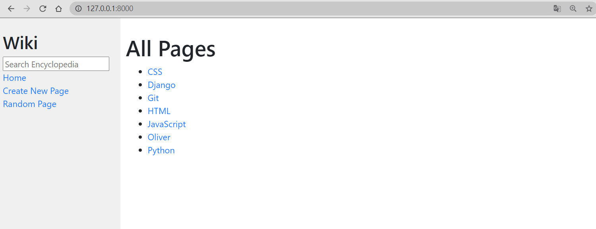
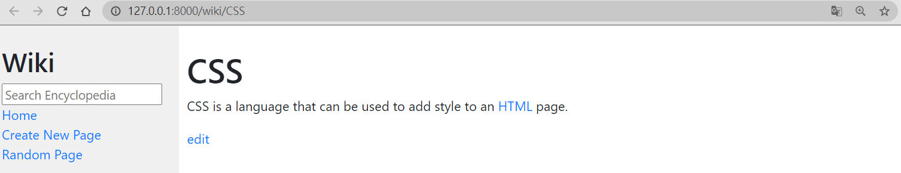
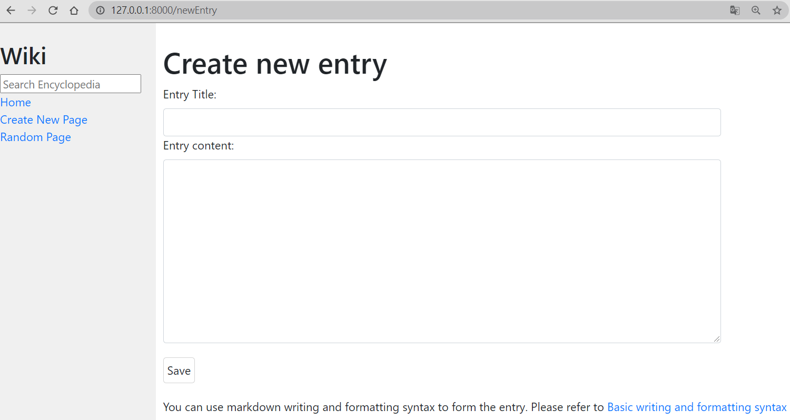
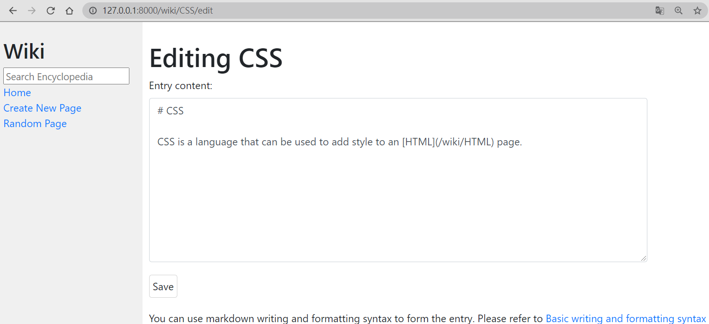

# wiki

This is a Harvard CS50 Web project. The goal is to design a Wikipedia-like online encyclopedia.  
This site allows users to view, search, create, and edit entry.  

Below is some demonstrations.

Homepage:  

View entry:  

Create new entry:

Edit new entry:  

